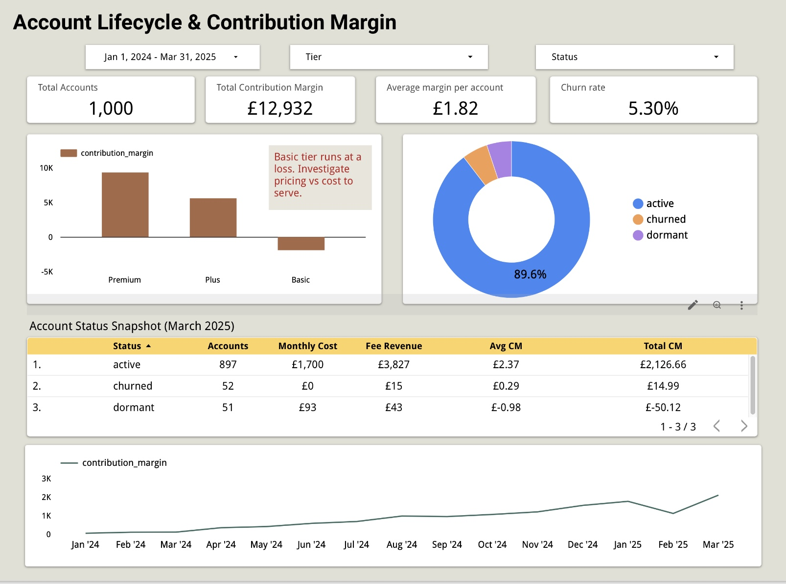
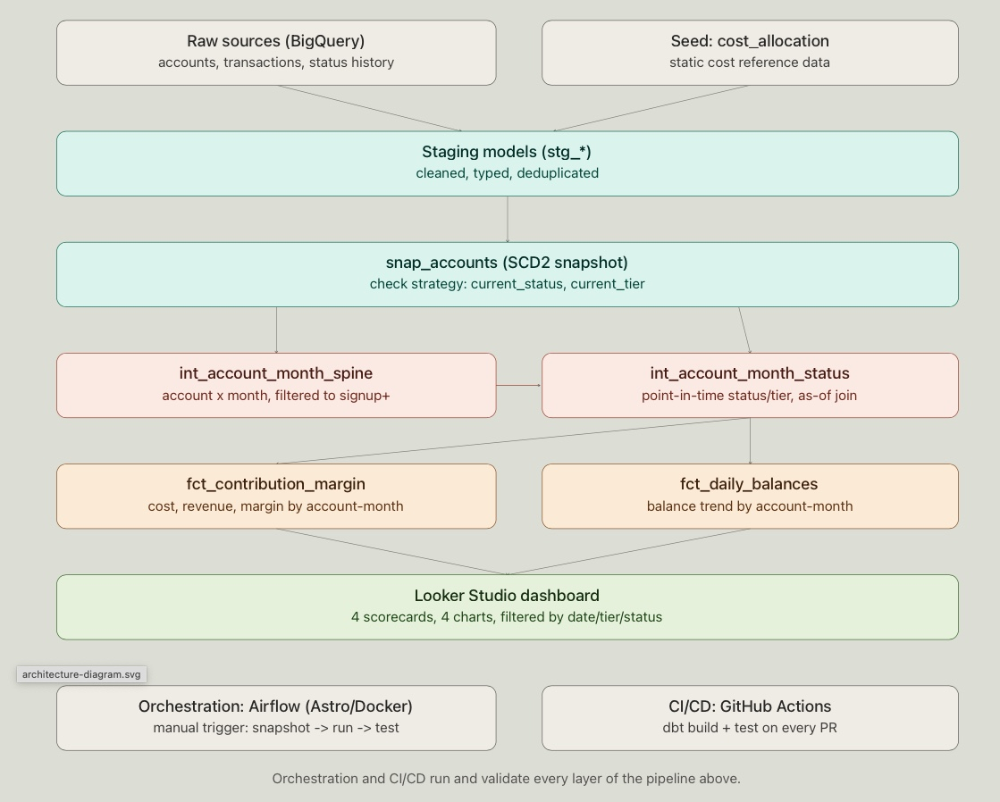
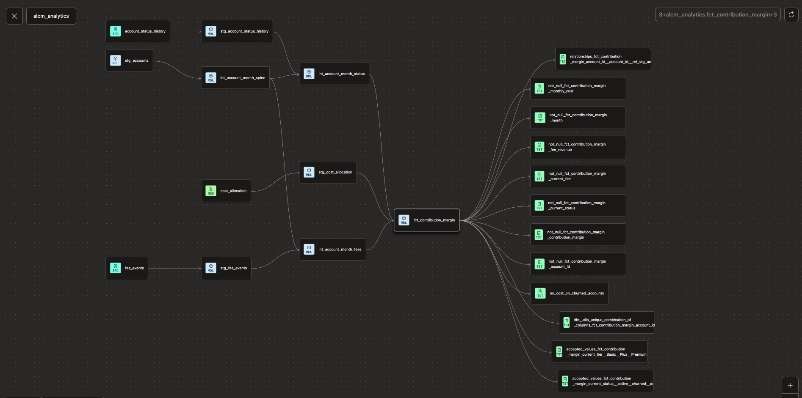
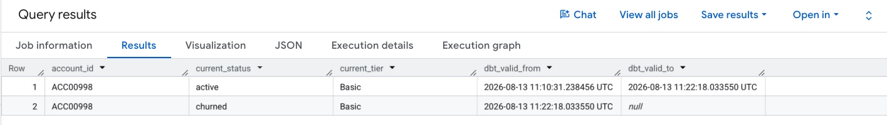
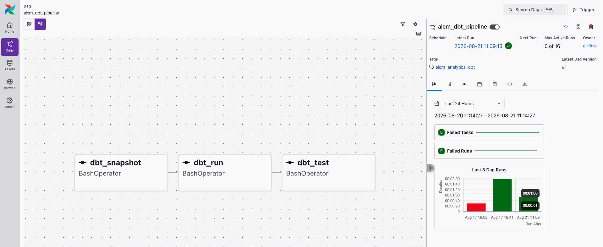
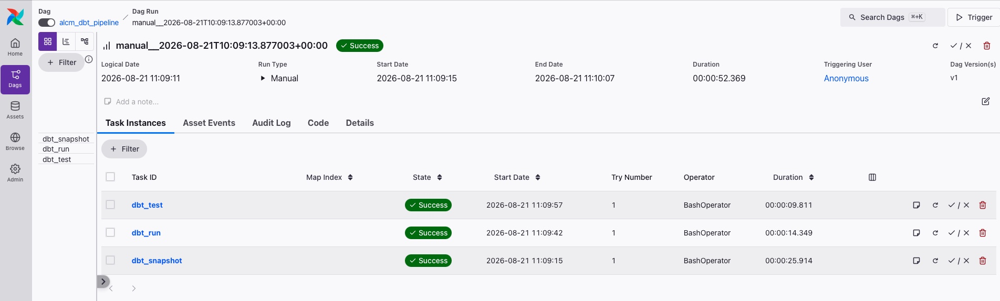
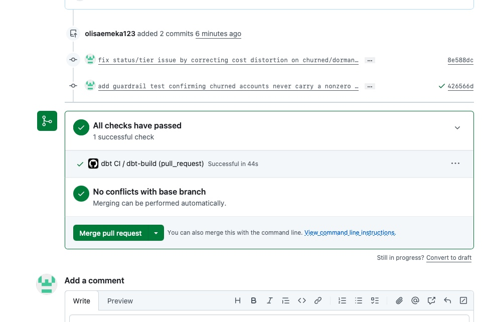
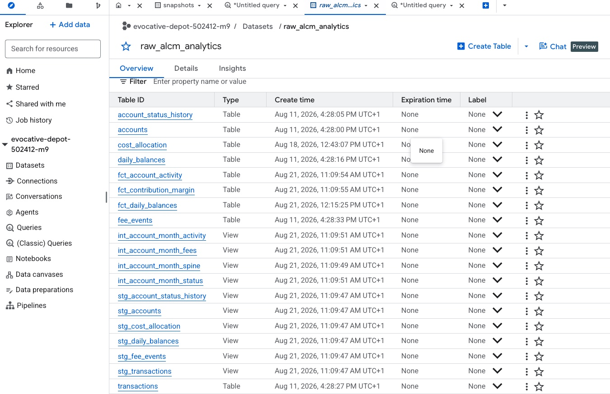
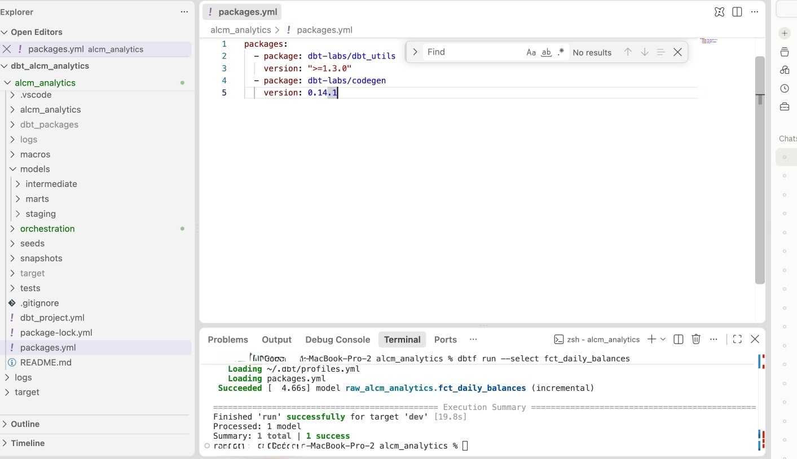

# Account Lifecycle & Contribution Margin (ALCM) Analytics

A dbt project that mirrors the financial lifecycle of accounts in fintech including signup, active tenure, tier changes, dormancy. This project creates governed & tested marts orchestrated with Airflow and surfaced in a Looker Studio dashboard.

It is built to demonstrate analytics engineering practices. Contents include SCD2 snapshots, data modeling, incremental models, model contracts, orchestration, CI/CD etc.



## Table of Contents

- [Overview](#overview)
- [Architecture](#architecture)
- [Key Design Decisions](#key-design-decisions)
- [The Point-in-Time Status Fix](#the-point-in-time-status-fix)
- [Data Quality & Testing](#data-quality--testing)
- [Orchestration: Airflow](#orchestration-airflow)
- [CI/CD](#cicd)
- [Warehouse Output](#warehouse-output)
- [Tech Stack](#tech-stack)
- [Project Structure](#project-structure)
- [Known Limitations](#known-limitations)

## Overview

**Goal:** Model an account based subscription business the way a finance/risk analytics team would. Include status and tier per account-month, contribution margin etc.

**Stack:** dbt Fusion → BigQuery → Airflow (orchestration) → Looker Studio.

## Architecture

Six layers.

```
sources/        → raw account, transaction, and status history tables in BigQuery
seeds/          → cost_allocation (static cost reference data)
staging/        → stg_accounts, stg_account_status_history, etc. 
snapshots/      → snap_accounts, SCD2 (check strategy on current_status, current_tier)
intermediate/   → int_account_month_spine (account & month grid, filtered to signup+)
                  int_account_month_status ( status/tier, as of join)
marts/          → fct_contribution_margin, fct_daily_balances
                  ↓
Looker Studio dashboard

orchestrated by → Airflow (Astro/Docker): dbt_snapshot >> dbt_run >> dbt_test
validated by    → GitHub Actions: dbt build + test on every PR
```



**Lineage graph.** From source,staging,intermediate models and the final marts. It includes schema tests attached at the point risk is introduced:



## Key Design Decisions

**Dynamic status resolution, not a static join.** Marts originally joined `stg_accounts` for tier/status, which only holds each account's *current* value. This applied one static value across every historical month. Fixed with `int_account_month_status`, a join against `stg_account_status_history`. 

**Snapshot strategy: `check`, not `timestamp`.** There's no timestamp field that actually reflects when a row changed.Since an account can move status or tier over time, checking those columns directly made sense so `check` on `current_status`/`current_tier` was the strategy used.

**Seed vs. source: `cost_allocation`.** It's a small static table that will never change.Using a full BigQuery table for it wasn't worth the cost especially as a seed does the job for free.

**Source freshness:** None of the raw tables have a genuine "when was this row loaded" timestamp field.`loaded_at_field` uses a business-date column as a proxy instead, a different one per table:

- `accounts` → `signup_date`
- `account_status_history` → `effective_date`
- `daily_balances` → `balance_date`
- `transactions` → `transaction_date`
- `fee_events` → `fee_date`

Thresholds: `warn_after: 700 days`, `error_after: 900 days`, the same across all five. The dataset's most recent business date is around March 2025, and "today" keeps moving forward while this static dataset never will. With realistic thresholds like 60/90 days, the check would sit in permanent ERROR as it'll be comparing a fixed historical date against an ever-advancing "now". Generous thresholds let the check demonstrate the mechanism correctly and pass, with the tradeoff explained.

**Dormant vs. churned accounts** Dormant accounts are still open & operational and continue to incur a maintenance cost while churned accounts are fully closed and don't incur any cost. This distinction is resolved in `int_account_month_status` and drives the cost logic in `fct_contribution_margin`.

## The Point-in-Time Status Fix

**The problem.** I spotted a modelling error where Total contribution margin summed to **-2,544**, which didn't reconcile to the original dataset. This was because:

1. **Pre signup cost padding**: `int_account_month_spine` generated a row for every account for every month in the full date range, including months before `signup_date`. Cost was charged for months an account didn't exist yet.
2. **Churned/dormant accounts still charged full cost**: After fixing the 1st issue, churned and dormant accounts kept showing full `monthly_cost` months after they stopped being active, since `current_status` is always "as of today."

**The fix.**

Filter the spine to valid months:
```sql
where date_trunc(a.signup_date, month) <= cast(m.date_month as date)
```

Build a point-in-time join (`int_account_month_status.sql`):
```sql
left join {{ ref('stg_account_status_history') }} as history
  on spine.account_id = history.account_id
  and date_trunc(history.effective_date, month) <= spine.month
qualify row_number() over (
  partition by account_id, month
  order by effective_date desc
) = 1
```

Both `fct_contribution_margin` and `fct_daily_balances` were rewired to join `int_account_month_status` instead of `stg_accounts`, matched on `account_id` **and** `month`:
```sql
case when s.status = 'churned' then 0 else b.monthly_cost_per_account end
```
Both rebuilt with `--full-refresh`, since this was a retroactive logic change.

**Verification.** Full rebuild and full test suite passing. Several accounts manually traced through `int_account_month_status`, confirming status/tier now change at the correct month. **Total contribution margin moved from -2,544 to +12,932.**



Branch: `feature/point-in-time-status`. PR written, merged, branch deleted.

## Data Quality & Testing

Generic tests (`unique`, `not_null`, `accepted_values`, `relationships`) and a targeted singular test to ensure the point in time fix stayed accurate:

- **`no_cost_on_churned_accounts.sql`**  This test confirms no churned account,month ever shows a nonzero `monthly_cost` in `fct_contribution_margin`. Deliberately placed at the mart (business-outcome) level rather than the root cause model, to test end to end financial correctness.
- Source freshness tests on the raw account/status tables.
- `.yml` documentation added for both new intermediate models (`int_account_month_spine`, `int_account_month_status`).

**Incremental modeling.** `fct_daily_balances` is materialized incrementally. Its compiled `MERGE` statement filters the source to only rows newer than the max `balance_date` already in the table:

```sql
where d.balance_date > (select max(balance_date) from fct_daily_balances)
```

## Orchestration: Airflow

Built with the Astro CLI (local Docker based Airflow). DAG `alcm_dbt_pipeline`, schedule `None`. I used manual trigger only as the project's dataset is static. Three chained `BashOperator` tasks: `dbt_snapshot >> dbt_run >> dbt_test`.

Issues noted and resolved:

1. **`SHELL` env var not set** :dbt Fusion install script failed in the Dockerfile with `sh: 336: SHELL: parameter not set`, since Docker's non interactive build shell doesn't set `$SHELL`. Fixed with `export SHELL=/bin/bash` before the installer.
2. **Build-time vs. runtime user mismatch**:The Dockerfile's `RUN` step executes as `root`, so the installer resolved to `/root/.local/bin`, not `/home/astro/.local/bin`. A naive `find /home/astro` found nothing.
3. **`webserver` → `api-server` rename** : a volume mount referencing the old Astro service name failed. Diagnosed via `docker ps` to see actual running container names.





## CI/CD

GitHub Actions runs `dbt build` on every pull request. 



## Warehouse Output

**Known limitation:** all staging, intermediate, and mart models currently live in a single BigQuery dataset (`raw_alcm_analytics`), rather than separate raw/staging/marts datasets.




## Tech Stack

| Layer | Tool |
|---|---|
| Transformation | dbt Fusion (`dbtf`, v2.0.0-preview) |
| Warehouse | Google BigQuery (`evocative-depot-502412-m9`) |
| Orchestration | Apache Airflow via Astro CLI (local Docker) |
| CI/CD | GitHub Actions |
| BI | Looker Studio |
| Local dev | VS Code, MacBook Pro (Apple Silicon) |

## Project Structure



```
alcm_analytics/
  models/
    staging/
      stg_accounts.sql
      stg_account_status_history.sql
    intermediate/
      int_account_month_spine.sql
      int_account_month_status.sql
    marts/
      fct_contribution_margin.sql
      fct_daily_balances.sql
  snapshots/
    snap_accounts.sql
  seeds/
    cost_allocation.csv
  tests/
    no_cost_on_churned_accounts.sql
  orchestration/
    dags/
      alcm_dbt_pipeline.py
    Dockerfile
    docker-compose.override.yml
```

## Known Limitations

- **Single BigQuery dataset** staging, intermediate, and marts all live in `raw_alcm_analytics` rather than separate datasets.
- **Static, manually triggered pipeline** `schedule=None` by design, reflecting the static dataset rather than a live feed.

